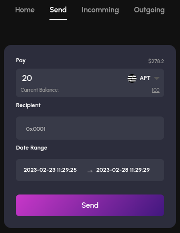

# MoveFlow
A crypto asset streaming protocol
> Testnet Demo: https://www.moveflow.xyz/
>
> Intro Video: ??
>


# Getting Started
Configure & Compile & Integration Test & Publish

## Roles & Authorizations
- `owner`: `publish`, `initialize`(including `set_admin` & `set_fee_point`)
- `admin`: `register_coin`
- `user`: `create`, `withdraw`, `close`

## Configure for Aptos Env
run `aptos init` to config aptos network environment

example result
```bash
git clone https://github.com/Move-Stream/movecontract.git
cd movecontract
aptos init
# Configuring for aptos testnet ...
cat .aptos/config.yaml 
---
profiles:
  default:
    private_key: <your privkey>
    public_key: <your pubkey>
    account: <your address>
    rest_url: "https://fullnode.testnet.aptoslabs.com"
```

## Compile & Unit Test
```bash
aptos move compile --named-addresses Stream=<your address>
aptos move test --named-addresses Stream=<your address>,Admin=<admin address>
```
example
```bash
aptos move compile --named-addresses Stream=0x0e1cad35db73ecab64d22230b2e9a59ba0cee1104bbf71fcd566f047ec40da4b
aptos move test --named-addresses Stream=0x0e1cad35db73ecab64d22230b2e9a59ba0cee1104bbf71fcd566f047ec40da4b,Admin=0x0e1cad35db73ecab64d22230b2e9a59ba0cee1104bbf71fcd566f047ec40da4c
```

## Integration Test
Test coins
```move
module mycoin::Coins {
    /// Coin definition
    ////////////////////////
    struct TestCoin {}

    struct XBTC {}

    struct XETH {}

    struct XDOT {}
    ////////////////////////
}
```

Testing cmds
```bash
# publish mycoin module for coins issuing
aptos move publish \
    --named-addresses mycoin=0x7f2868a381a1aa961cb4ce4dc3e0f9146b787b342fd0a45c1f1d9240df0e2368

# issue coins
# initialize coins
aptos move run \
    --function-id 0x1::managed_coin::initialize \
    --args string:"Test" string:"Test" u8:8 bool:true \
    --type-args 0x7f2868a381a1aa961cb4ce4dc3e0f9146b787b342fd0a45c1f1d9240df0e2368::Coins::TestCoin \
    --assume-yes

aptos move run \
    --function-id 0x1::managed_coin::initialize \
    --args string:"XBTC" string:"XBTC" u8:8 bool:true \
    --type-args 0x7f2868a381a1aa961cb4ce4dc3e0f9146b787b342fd0a45c1f1d9240df0e2368::Coins::XBTC \
    --assume-yes

aptos move run \
    --function-id 0x1::managed_coin::initialize \
    --args string:"XETH" string:"XETH" u8:8 bool:true \
    --type-args 0x7f2868a381a1aa961cb4ce4dc3e0f9146b787b342fd0a45c1f1d9240df0e2368::Coins::XETH \
    --assume-yes

aptos move run \
    --function-id 0x1::managed_coin::initialize \
    --args string:"XDOT" string:"XDOT" u8:8 bool:true \
    --type-args 0x7f2868a381a1aa961cb4ce4dc3e0f9146b787b342fd0a45c1f1d9240df0e2368::Coins::XDOT \
    --assume-yes

# stores balance of coins on user's account, withdraw and deposit event handlers 
aptos move run \
    --function-id 0x1::managed_coin::register \
    --type-args 0x7f2868a381a1aa961cb4ce4dc3e0f9146b787b342fd0a45c1f1d9240df0e2368::Coins::TestCoin \
    --assume-yes

aptos move run \
    --function-id 0x1::managed_coin::register \
    --type-args 0x7f2868a381a1aa961cb4ce4dc3e0f9146b787b342fd0a45c1f1d9240df0e2368::Coins::XBTC \
    --assume-yes

aptos move run \
    --function-id 0x1::managed_coin::register \
    --type-args 0x7f2868a381a1aa961cb4ce4dc3e0f9146b787b342fd0a45c1f1d9240df0e2368::Coins::XETH \
    --assume-yes

aptos move run \
    --function-id 0x1::managed_coin::register \
    --type-args 0x7f2868a381a1aa961cb4ce4dc3e0f9146b787b342fd0a45c1f1d9240df0e2368::Coins::XDOT \
    --assume-yes

# mint coins
aptos move run \
    --function-id 0x1::managed_coin::mint \
    --args address:0x7f2868a381a1aa961cb4ce4dc3e0f9146b787b342fd0a45c1f1d9240df0e2368 u64:10000000000 \
    --type-args 0x7f2868a381a1aa961cb4ce4dc3e0f9146b787b342fd0a45c1f1d9240df0e2368::Coins::TestCoin \
    --assume-yes

aptos move run \
    --function-id 0x1::managed_coin::mint \
    --args address:0x7f2868a381a1aa961cb4ce4dc3e0f9146b787b342fd0a45c1f1d9240df0e2368 u64:10000000000 \
    --type-args 0x7f2868a381a1aa961cb4ce4dc3e0f9146b787b342fd0a45c1f1d9240df0e2368::Coins::XBTC \
    --assume-yes

aptos move run \
    --function-id 0x1::managed_coin::mint \
    --args address:0x7f2868a381a1aa961cb4ce4dc3e0f9146b787b342fd0a45c1f1d9240df0e2368 u64:10000000000 \
    --type-args 0x7f2868a381a1aa961cb4ce4dc3e0f9146b787b342fd0a45c1f1d9240df0e2368::Coins::XETH \
    --assume-yes

aptos move run \
    --function-id 0x1::managed_coin::mint \
    --args address:0x7f2868a381a1aa961cb4ce4dc3e0f9146b787b342fd0a45c1f1d9240df0e2368 u64:10000000000 \
    --type-args 0x7f2868a381a1aa961cb4ce4dc3e0f9146b787b342fd0a45c1f1d9240df0e2368::Coins::XDOT \
    --assume-yes

==================================================================================================

# publish moveflow
aptos move publish --named-addresses Stream=0x7f2868a381a1aa961cb4ce4dc3e0f9146b787b342fd0a45c1f1d9240df0e2368

# set admin and fee_recipient
aptos move run \
    --function-id 0x7f2868a381a1aa961cb4ce4dc3e0f9146b787b342fd0a45c1f1d9240df0e2368::movepay::initialize \
    --args address:0x7f2868a381a1aa961cb4ce4dc3e0f9146b787b342fd0a45c1f1d9240df0e2368 \
           address:0x7f2868a381a1aa961cb4ce4dc3e0f9146b787b342fd0a45c1f1d9240df0e2368

# register coins on moveflow
aptos move run \
    --function-id 0x7f2868a381a1aa961cb4ce4dc3e0f9146b787b342fd0a45c1f1d9240df0e2368::movepay::register_coin \
    --type-args 0x1::aptos_coin::AptosCoin \
    --assume-yes

aptos move run \
    --function-id 0x7f2868a381a1aa961cb4ce4dc3e0f9146b787b342fd0a45c1f1d9240df0e2368::movepay::register_coin \
    --type-args 0x7f2868a381a1aa961cb4ce4dc3e0f9146b787b342fd0a45c1f1d9240df0e2368::Coins::XBTC \
    --assume-yes

aptos move run \
    --function-id 0x7f2868a381a1aa961cb4ce4dc3e0f9146b787b342fd0a45c1f1d9240df0e2368::movepay::register_coin \
    --type-args 0x7f2868a381a1aa961cb4ce4dc3e0f9146b787b342fd0a45c1f1d9240df0e2368::Coins::XETH \
    --assume-yes

aptos move run \
    --function-id 0x7f2868a381a1aa961cb4ce4dc3e0f9146b787b342fd0a45c1f1d9240df0e2368::movepay::register_coin \
    --type-args 0x7f2868a381a1aa961cb4ce4dc3e0f9146b787b342fd0a45c1f1d9240df0e2368::Coins::XDOT \
    --assume-yes

aptos move run \
    --function-id 0x7f2868a381a1aa961cb4ce4dc3e0f9146b787b342fd0a45c1f1d9240df0e2368::movepay::register_coin \
    --type-args 0x7f2868a381a1aa961cb4ce4dc3e0f9146b787b342fd0a45c1f1d9240df0e2368::Coins::TestCoin \
    --assume-yes

# create a payment stream
aptos move run \
    --function-id 0x7f2868a381a1aa961cb4ce4dc3e0f9146b787b342fd0a45c1f1d9240df0e2368::movepay::create \
    --args u64:0 u64:1000 u64:10000 \
    --type-args 0x1::aptos_coin::AptosCoin \
    --assume-yes

aptos move run \
    --function-id 0x7f2868a381a1aa961cb4ce4dc3e0f9146b787b342fd0a45c1f1d9240df0e2368::movepay::create \
    --args u64:1 u64:1000 u64:10000 \
    --type-args 0x7f2868a381a1aa961cb4ce4dc3e0f9146b787b342fd0a45c1f1d9240df0e2368::Coins::XBTC \
    --assume-yes

aptos move run \
    --function-id 0x7f2868a381a1aa961cb4ce4dc3e0f9146b787b342fd0a45c1f1d9240df0e2368::movepay::create \
    --args u64:2 u64:1000 u64:10000 \
    --type-args 0x7f2868a381a1aa961cb4ce4dc3e0f9146b787b342fd0a45c1f1d9240df0e2368::Coins::XETH \
    --assume-yes

aptos move run \
    --function-id 0x7f2868a381a1aa961cb4ce4dc3e0f9146b787b342fd0a45c1f1d9240df0e2368::movepay::create \
    --args u64:3 u64:1000 u64:10000 \
    --type-args 0x7f2868a381a1aa961cb4ce4dc3e0f9146b787b342fd0a45c1f1d9240df0e2368::Coins::XDOT \
    --assume-yes

aptos move run \
    --function-id 0x7f2868a381a1aa961cb4ce4dc3e0f9146b787b342fd0a45c1f1d9240df0e2368::movepay::create \
    --args u64:4 u64:1000 u64:10000 \
    --type-args 0x7f2868a381a1aa961cb4ce4dc3e0f9146b787b342fd0a45c1f1d9240df0e2368::Coins::TestCoin \
    --assume-yes

```