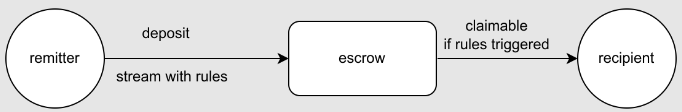
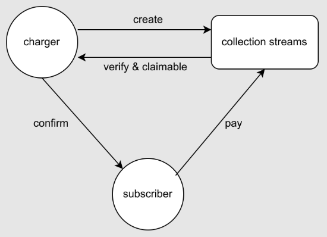

# MoveFlow
A crypto asset streaming protocol
> Testnet Demo: https://www.moveflow.xyz/
>
> Intro Video: ??
> 
>Deck Link: https://pitch.com/public/619e0d9b-2d58-4a8b-8cc8-e16764bbc4f5/bec72e82-24e5-4de2-94bb-4efa596d51e1
>


# Introduction
## In Brief
MOVEFLOW is an crypto asset streaming protocol built on the public chain APTOS.

MOVEFLOW is able to transfer assets on chain according to predefined rules. With one transaction, funds will flow from your wallet to the recipient real-time(by second), to conduct timely financial transactions without intermediaries.

Please refer to the chart below for Moveflow's basis structure:


## Background
In 2016, Andreas M. Antonopoulos delivered this exceptional keynote on “Streaming Money” at the Special Edition of the [Bitcoin Wednesday Conference at the Eye Film Museum in Amsterdam on 19 October, 2016](https://www.youtube.com/watch?v=l235ydAx5oQ).

In 2018, Paul Razvan Berg created the technical standard of streaming payment: [EIP-1620: Money Streaming](https://eips.ethereum.org/EIPS/eip-1620).

As of the end of 2022, most prominent public blockchains have their web3 asset streaming protocol like: Sablier, Superfluid, Roketo, Zebec, Calamus, LlamaPay, etc. And we believe APTOS needs its own web3 asset streaming protocol, whose extremely high TPS and low transaction bring excellent user expreience when conducting transactions.

## Features
* Asset stream(transfer) by second



* Subscription payment (in progress)



# Getting Started
Configure & Compile & Integration Test & Publish

## Roles & Authorizations
- `owner`: `publish`, `initialize`(including set `admin` & `fee_recipient`), `set_fee_point`
- `admin`: `register_coin`
- `user`: `create`, `withdraw`, `close`

## Configure for Aptos Env
run `aptos init` to config aptos network environment

example result
```bash
git clone https://github.com/Move-Stream/movecontract.git
cd movecontract
aptos init
# Configuring for aptos testnet ...
cat .aptos/config.yaml 
---
profiles:
  default:
    private_key: <your privkey>
    public_key: <your pubkey>
    account: <your address>
    rest_url: "https://fullnode.testnet.aptoslabs.com"
```

## Compile & Unit Test
```bash
aptos move compile --named-addresses Stream=<your address>
aptos move test --named-addresses Stream=<your address>,Admin=<admin address>
```
example
```bash
aptos move compile --named-addresses Stream=0x0e1cad35db73ecab64d22230b2e9a59ba0cee1104bbf71fcd566f047ec40da4b
aptos move test --named-addresses Stream=0x0e1cad35db73ecab64d22230b2e9a59ba0cee1104bbf71fcd566f047ec40da4b,Admin=0x0e1cad35db73ecab64d22230b2e9a59ba0cee1104bbf71fcd566f047ec40da4c
```

## Integration Test
Test coins
```move
module mycoin::Coins {
    /// Coin definition
    ////////////////////////
    struct TestCoin {}

    struct XBTC {}

    struct XETH {}

    struct XDOT {}
    ////////////////////////
}
```

Testing cmds(mock test coin)
```bash
# publish mycoin module for coins issuing
aptos move publish \
    --named-addresses mycoin=<publish_address>

# issue coins
# initialize coins
aptos move run \
    --function-id 0x1::managed_coin::initialize \
    --args string:"Test" string:"Test" u8:8 bool:true \
    --type-args <publish_address>::Coins::TestCoin \
    --assume-yes

aptos move run \
    --function-id 0x1::managed_coin::initialize \
    --args string:"XBTC" string:"XBTC" u8:8 bool:true \
    --type-args <publish_address>::Coins::XBTC \
    --assume-yes

aptos move run \
    --function-id 0x1::managed_coin::initialize \
    --args string:"XETH" string:"XETH" u8:8 bool:true \
    --type-args <publish_address>::Coins::XETH \
    --assume-yes

aptos move run \
    --function-id 0x1::managed_coin::initialize \
    --args string:"XDOT" string:"XDOT" u8:8 bool:true \
    --type-args <publish_address>::Coins::XDOT \
    --assume-yes

# stores balance of coins on user's account, withdraw and deposit event handlers 
aptos move run \
    --function-id 0x1::managed_coin::register \
    --type-args <publish_address>::Coins::TestCoin \
    --assume-yes

aptos move run \
    --function-id 0x1::managed_coin::register \
    --type-args <publish_address>::Coins::XBTC \
    --assume-yes

aptos move run \
    --function-id 0x1::managed_coin::register \
    --type-args <publish_address>::Coins::XETH \
    --assume-yes

aptos move run \
    --function-id 0x1::managed_coin::register \
    --type-args <publish_address>::Coins::XDOT \
    --assume-yes

# mint coins
aptos move run \
    --function-id 0x1::managed_coin::mint \
    --args address:<reciver_address> u64:10000000000 \
    --type-args <publish_address>::Coins::TestCoin \
    --assume-yes

aptos move run \
    --function-id 0x1::managed_coin::mint \
    --args address:<reciver_address> u64:10000000000 \
    --type-args <publish_address>::Coins::XBTC \
    --assume-yes

aptos move run \
    --function-id 0x1::managed_coin::mint \
    --args address:<reciver_address> u64:10000000000 \
    --type-args <publish_address>::Coins::XETH \
    --assume-yes

aptos move run \
    --function-id 0x1::managed_coin::mint \
    --args address:<reciver_address> u64:10000000000 \
    --type-args <publish_address>::Coins::XDOT \
    --assume-yes

==================================================================================================

# publish moveflow
aptos move publish --named-addresses Stream=<publish_address>

# set admin and fee_recipient
aptos move run \
    --function-id <publish_address>::movepay::initialize \
    --args address:<admin_address> \
           address:<fee_recipient>

# register coins on moveflow
aptos move run \
    --function-id <publish_address>::movepay::register_coin \
    --type-args 0x1::aptos_coin::AptosCoin \
    --assume-yes

aptos move run \
    --function-id <publish_address>::movepay::register_coin \
    --type-args <publish_address>::Coins::XBTC \
    --assume-yes

aptos move run \
    --function-id <publish_address>::movepay::register_coin \
    --type-args <publish_address>::Coins::XETH \
    --assume-yes

aptos move run \
    --function-id <publish_address>::movepay::register_coin \
    --type-args <publish_address>::Coins::XDOT \
    --assume-yes

aptos move run \
    --function-id <publish_address>::movepay::register_coin \
    --type-args <publish_address>::Coins::TestCoin \
    --assume-yes

# create a payment stream
aptos move run \
    --function-id <publish_address>::movepay::create \
    --args u64:0 u64:1000 u64:10000 \
    --type-args 0x1::aptos_coin::AptosCoin \
    --assume-yes

aptos move run \
    --function-id <publish_address>::movepay::create \
    --args u64:1 u64:1000 u64:10000 \
    --type-args <publish_address>::Coins::XBTC \
    --assume-yes

aptos move run \
    --function-id <publish_address>::movepay::create \
    --args u64:2 u64:1000 u64:10000 \
    --type-args <publish_address>::Coins::XETH \
    --assume-yes

aptos move run \
    --function-id <publish_address>::movepay::create \
    --args u64:3 u64:1000 u64:10000 \
    --type-args <publish_address>::Coins::XDOT \
    --assume-yes

aptos move run \
    --function-id <publish_address>::movepay::create \
    --args u64:4 u64:1000 u64:10000 \
    --type-args <publish_address>::Coins::TestCoin \
    --assume-yes

# extend a payment stream
aptos move run \
--function-id <publish_address>::movepay::extend \
--args u64:<new_stop_time> u64:<coin_id> u64:<stream_id> \
--type-args <coin_type>


# close a payment stream
aptos move run \
--function-id <publish_address>::movepay::close \
--args u64:<coin_id> u64:<stream_id> \
--type-args <coin_type>


# withdraw a payment stream
aptos move run \
--function-id <publish_address>::movepay::withdraw \
--args u64:<coin_id> u64:<stream_id> \
--type-args <coin_type>

```

# Team
* [1730.eth](https://github.com/bengbengle): Years of technical finance and blockchain software development experience, full-stack development, keen on encryption art.
* [Albin](https://github.com/albinlau): Software development engineer for over 10 years, 3 years
  smart contract development experience, presided over the development of multiple web3 applications.
* [Burt](https://github.com/livelybug): Full-stack blockchain developer, working overseas for 8 years , 5 years of blockchain development experience, presided over the development of multiple cross-chains
  project.
* Lynn: Years of web3 brand marketing and product operation experience.
